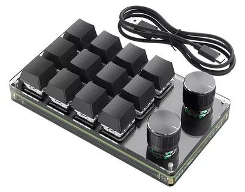
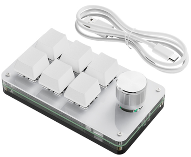
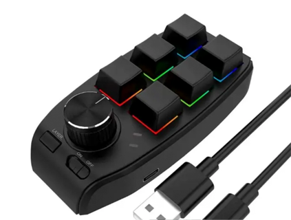
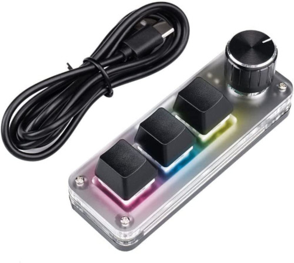
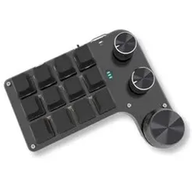
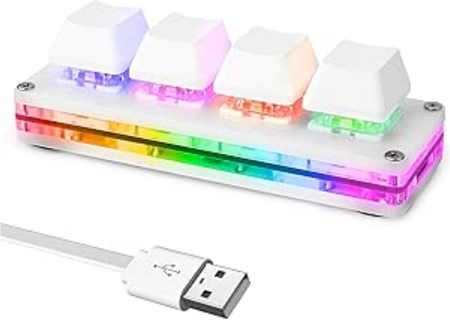

# ch57x-keyboard-tool Macro Keyboard Configuration Utility

 

## Table of Contents <!-- omit in toc -->

* [What is this?](#what-is-this)
    * [Supported keyboards](#supported-keyboards)
* [Installation](#installation)
    * [Prebuilt release](#prebuilt-release)
    * [Build it yourself](#build-it-yourself)
* [Usage](#usage)
    * [Commands and options](#commands-and-options)
    * [Validate the config file](#validate-the-config-file)
    * [Upload the config to the keyboard](#upload-the-config-to-the-keyboard)
    * [Change LED configuration](#change-led-configuration)
    * [Windows / PowerShell](#windows--powershell)
* [FAQ](#faq)
    * [How to do … on key press?](#how-to-do--on-key-press)
    * [Can you implement … feature?](#can-you-implement--feature)
* [Notes](#notes)
    * [Number of layers](#number-of-layers)
    * [Custom keyboard layouts](#custom-keyboard-layouts)
    * [3x1 keys + 1 knob keyboard limitations](#3x1-keys--1-knob-keyboard-limitations)
    * [macOS vs Windows keyboard keys](#macos-vs-windows-keyboard-keys)
* [Diagnostics](#diagnostics)
    * [How to find and list connected USB devices](#how-to-find-and-list-connected-usb-devices)
        * [macOS](#macos)
        * [Linux](#linux)
        * [Windows](#windows)
    * [Monitoring generated keyboard and mouse events](#monitoring-generated-keyboard-and-mouse-events)
* [Supported macro keyboards](#supported-macro-keyboards)
    * [Photos of supported keyboards](#photos-of-supported-keyboards)

## What is this?

This keyboard configuration utility is for programming small keyboards, such as the one shown below:



Such macro keyboards are popular on AliExpress, and sellers often include software for programming, but:
* It requires Windows
* It is very ugly and inconvenient
* It can only program one key at a time
* It does not expose all keyboard features

There are several modifications of such keyboards with different numbers of buttons and knobs (see the [photos of supported keyboards](#photos-of-supported-keyboards)) and with/without Bluetooth.

Both wired and wireless keyboards are supported.
⚠️ However, the keyboard must be connected to the computer with a USB cable when programming.

### Supported keyboards

This utility has been reported to work with:
* 3×4 with 2 knobs (Bluetooth version)
* 3×3 with 2 knobs
* 3x2 with 1 knob
* 3x1 with 1 knob with [limitations](#3x1-keys--1-knob-keyboard-limitations)
* 4x1 without knobs

Keyboard with following vendor/product IDs are supported: `1189:8890`, `1189:8840`, `1189:8842` (hexadecimal).

For more details, refer to the [Supported Macro Keyboards](#supported-macro-keyboards) section.

## Installation

There are two ways to download the keyboard utility: getting a prebuilt release or building it yourself.

### Prebuilt release

Simply download the [latest release from GitHub](https://github.com/kriomant/ch57x-keyboard-tool/releases).

### Or build it yourself

1. Install the *cargo* utility using [rustup](https://rustup.rs/):
    * Brew: `brew install rustup-init && rustup-init`
    * Linux: `curl --proto '=https' --tlsv1.2 -sSf https://sh.rustup.rs | sh`
    * Windows: Download and run [rustup-init.exe](https://win.rustup.rs/)
2. Execute `cargo install ch57x-keyboard-tool`.

### If you are on Windows

Install [USBDK](https://github.com/daynix/UsbDk/releases).

## Usage

1. Connect the keyboard to the computer with a USB cable.
2. Study [available actions](doc/actions.md).
2. Create a configuration file based on the provided [example-mapping.yaml](example-mapping.yaml).
3. Validate the configuration file.
4. Upload the configuration to the keyboard.
5. Done! 🎉

### Create configuration file

Edit existing `example-mapping.yaml` or (better) save modified copy under different name.

Example config file has extensive documentation inside.

You may also get list of supported key names using:

```sh
./ch57x-keyboard-tool show-keys
```

### Validate the config file

```sh
./ch57x-keyboard-tool validate your-config.yaml
```

### Upload the config to the keyboard

```sh
./ch57x-keyboard-tool upload your-config.yaml
```

### Permissions on Linux

Use 'sudo' if you get 'Access denied (insufficient permissions)':

```sh
sudo ./ch57x-keyboard-tool upload your-config.yaml
```

Alternatively, you may configure *udev* to give all users permission to program keyboard:

Create file */etc/udev/rules.d/50-usb-macrokeyboard.rules* with content:
```
SUBSYSTEM=="usb", ATTR{idVendor}=="1189", ATTR{idProduct}=="8890", TAG+="uaccess"
```

Reload udev configuration
```sh
sudo udevadm control --reload
sudo udevadm trigger
```

### Change LED configuration

If your keyboard supports it, you can change the LED configuration.

**Note:** LED command arguments are model-specific. Different keyboard models have different LED capabilities.

#### 0x8840 and 0x8842

Syntax: `./ch57x-keyboard-tool led <layer> <mode>...`

Modes:
- *off* - LEDs off
- *backlight <color>* - backlight always on with color
- *shock <color>* - no backlight, shock effect with color when key pressed
- *shock2 <color>* - no backlight, shock2 effect with color when key pressed
- *press <color>* - no backlight, light up key with color when pressed

Supported key colors: *red*, *orange*, *yellow*, *green*, *cyan*, *blue*, *purple*.
Backlight additionally supports *white*.

#### 0x8890

Set the LED to the first mode (likely "Steady on")

```sh
./ch57x-keyboard-tool led 1
```

## FAQ

### How to do ... on key press?

A common question/request is about automation, such as "How to run a script?", "emulate several keys", or "how to trigger an action with a key press?"

This tool does just one job: **writes your key bindings into the keyboard** and then exits.
It does not listen for key presses.
Automation based on key presses is not within the scope of this utility tool.

If you seek any automation, use third-party automation tools like [BetterTouchTool](https://folivora.ai/).

1. Choose a chord you do not usually use (like `alt-ctrl-shift-1`).
2. Assign the chord to a key.
3. Use a third-party automation tool to listen for this chord and have it perform the desired action.
4. Done! 🎉

### Can you implement ... feature?

I don't have detailed datasheet for these keyboards. So I can say whether something can implemented until you show me any software that can do it. Then it is teoretically possible to replicate behavior.

However, doing it requires either exact keyboard model in my hands or you to performa reverse engeneering.

## Notes

### Number of layers

All keyboards I have seen have three layers (three key configurations which may be switched).
However, if your keyboard does not support layer switching, just keep a single layer in the configuration file.

### Custom keyboard layouts

Note that you specify key to emulate press for, not character which is produced by pressing it.
So if you use a custom keyboard layout, like [Dvorak](https://en.wikipedia.org/wiki/Dvorak_keyboard_layout), you have to see how required key is labelled in QWERTY layout.

### 3x1 keys + 1 knob keyboard limitations

This modification does support key modifiers (like `ctrl-`, `alt-`, and `cmd-`) for the first key in sequence only.

So, you can use: `ctrl-alt-del,1,2`, but not `ctrl-alt-del,alt-1,2`.

### macOS vs Windows keyboard keys

A friendly reminder that some keys have different names on macOS and Windows.
These keys have aliases for both platforms, you may use them interchangeably.

| Key Name          | macOS Key | Windows Key |
| ----------------- | --------- | ----------- |
| Command / Windows | `cmd`     | `win`       |
| Option / Alt      | `opt`     | `alt`       |

### Commands and options

```sh
ch57x-keyboard-tool [OPTIONS] <COMMAND>
```

Commands and their descriptions:

| Command                | Description                                               |
| ---------------------- | --------------------------------------------------------- |
| `show-keys`            | Display a list of all supported keys and modifiers        |
| `validate`             | Validate key mappings config from stdin                   |
| `upload`               | Upload key mappings from stdin to the device              |
| `led`                  | Configure LED backlight (model-specific arguments)        |
| `help`, `-h`, `--help` | Print this message or the help of the given subcommand(s) |

Advanced options, you don't have to use this normally:

| Option                      | Description                 | Notes            |
| --------------------------- | --------------------------- | ---------------- |
| `--vendor-id <VENDOR_ID>`   | Vendor ID of the keyboard   | Default: `4489`  |
| `--product-id <PRODUCT_ID>` | Product ID of the keyboard  | Default: `34960` |
| `--address <ADDRESS>`       | Address of the keyboard     |                  |

**⚠️ The ability to override the vendor/product ID does not mean that you can use this utility to program arbitrary keyboards!**

## Diagnostics

When reporting an issue, please include diagnostics such as the list of attached USB devices and the output of the `keyboard` and `mouse` monitoring tools.

### How to find and list connected USB devices

#### macOS

```sh
system_profiler SPUSBDataType
```

or

```sh
ioreg -w0 -l -p IOUSB
```

#### Linux

```sh
lsusb -v
```

#### Windows

```powershell
Get-PnpDevice | Where-Object { $_.Class -eq 'USB' } | Format-Table Name, DeviceID, Manufacturer, Status, Description -AutoSize
```

### Monitoring generated keyboard and mouse events

The simplest and cross-platform way to monitor keyboard and mouse events is using the `keyboard` and `mouse` Python modules.

Monitoring keyboard:

```sh
pip3 install keyboard
sudo python3 -m keyboard
```

Monitoring mouse:
* The latest published 'mouse' module doesn't support macOS, so use the latest version from GitHub

```sh
git clone https://github.com/boppreh/mouse
cd mouse
python3 -m mouse
```

## Supported macro keyboards

* Product ID: 0x8890, 0x8840
    * Vendor ID: 0x1189  (Trisat Industrial Co., Ltd.)
    * [amazon.co.jp/dp/B0CF5L8HP3](https://www.amazon.co.jp/dp/B0CF5L8HP3)

### Photos of supported keyboards

| Kind              | Photo
|-------------------|----------------------------------------
| 3x2 with 1 knob   | 
| 3x2 with 1 knob   | 
| 3x1 with 1 knob   | 
| 3×3 with 2 knobs  | 
| 4x3 with 3 knobs  | 
| 4×1 without knobs | 
